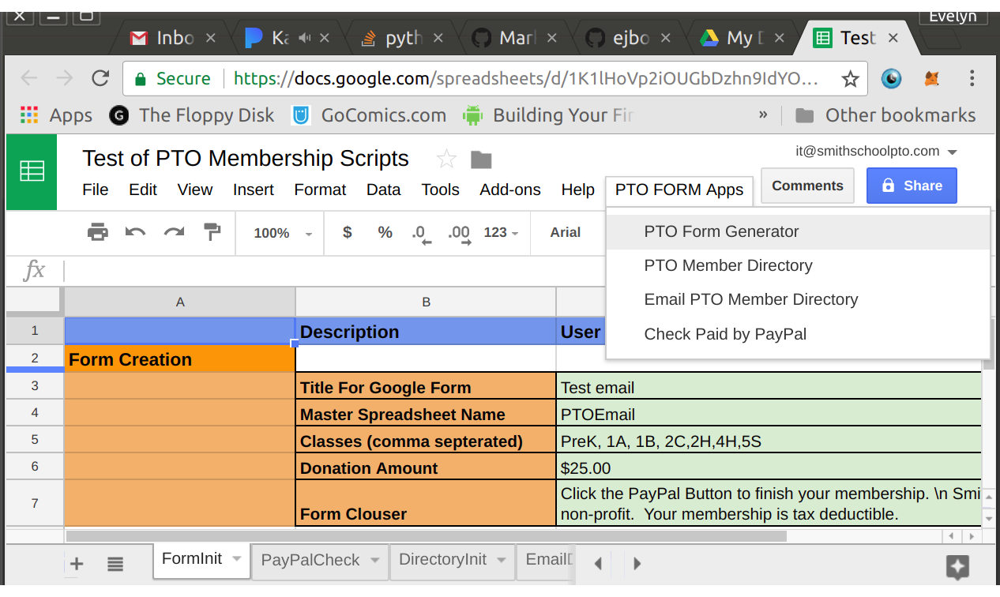
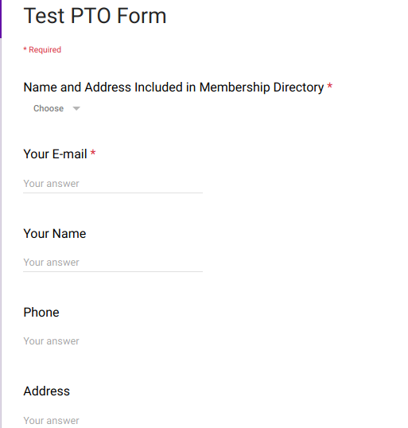
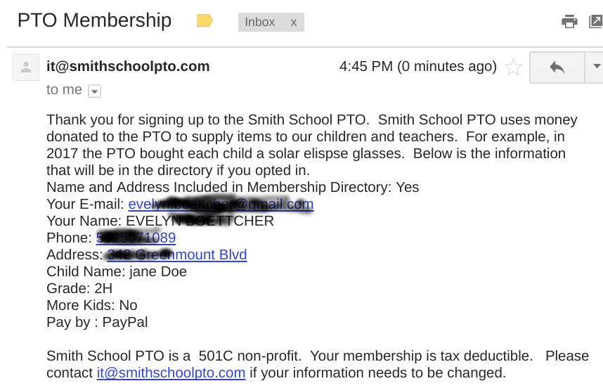

# Presentation to Smith School PTO

- Topics
  - Google for non Profits
  - Membership Directory Automation

by Evelyn Boettcher

--------------------
# Domain

Domain names are often simply referred to as domains and domain name registrants are frequently referred to as domain owners, although domain name registration with a registrar does not confer any legal ownership of the domain name, only an exclusive right of use for a *particular duration of time.*  Minimum duration is 1 year and max is typically 10 years.

Domain names are  used as simple identification labels to indicate ownership or control of a resource.
A generic domain is a name that defines a general category, rather than a specific or personal instance, for example, the name of an industry, rather than a company name. Some examples of generic names are books.com, music.com, and travel.info. Companies have created brands based on generic names, and such generic domain names may be valuable.

A domain name is not a website.  It gives you and only you the right to use that address.

A domain name can be used with an email address without a website attached.

## Google for Work and for Nonprofits require a domain name be established and linked to the users account.

---------

# SmithSchoolPTO.com

The Domain name **SmithSchoolPTO.com** has been purchased for the use by Smith School PTO for 5 years.  It will need to be renewed at a cost of about $12 per year.  While Smith School PTO has this domain, they have the first rights to renew it and it can be renewed anytime.

---------

# Google for Nonprofits

Google offers for Non profits (must be certified first) a service similar to Google for Work.  This gives you the following:
* Secure file sharing within your group
* Data storage (up to a limit ~10GB?)
* Google Sites
* Google email (~ 50 users)
* Google Doc, sheets and forms.

This would cost a business about $5 per user per month.  But it is **FREE** for non-profits.

--------

# Google for Nonprofits

Within the users group files can be restricted by inter group functions.

e.g. Accounting documents can only be viewed by treasurer and president.

## Advantages of Google for NonProfits
  * It's **FREE**

  * Personal Data (parents' addresses, names, kids, amount donated etc) not located on an individual's computer or on-line Service

  * Send emails from a your organization's domain.  
    * Makes the organization seem more professional and may reduce fraud.
    * Your personal email address is not tied nor given out to the public.
        * So 5 years from now you will not get PTO emails to your personal account.
  * Organization Data is Centralized
  * Organization data is backed up
     * Google makes back up's of the data so as long as you do not delete it, it will be there.

## Advantages of Centralized Location:
   * Makes hand-off to new PTO leaders easier.
   * Documents like membership directory, PTO's ledger etc can live in one place.
      * Helps prevent out of date documentations form being used

  ---------------------------------------

# PTO Membership Directory

## Goals
- [x] On-line membership form  (via Google Forms)
- [x] Auto generate Form (via Google scripts)
- [ ] Automation of Membership directory (via Google scripts)
- [ ] On-line payment (via Google scripts)
- [ ] On-line payment verification
- [x] Automate sending membership directory to PTO members (via Google scripts)

## Code Stored Here
[PTO Github account](https://github.com/ejboettcher/PTO_MemberDir_Creator)

-------------------------------------------------
## Evelyn's Goals
  * All steps can be down manually
   - [x] On-line membership forms  (via Google Forms)
   - [x] Generate Form manually
   - [x] Generate PTO Directory (manually filler pages)
   - [x] On-line Payment
   - [x] Manually verify Payment
   - [x] Email Membership Directory (manually send email)

------------------------

# Walk through PTO scripts
## All scripts are in a Google Sheets file
* Sheet files has four sheets:
  * **FormInit**: Main sheet for generating a on-line forms
    * **APP**: PTO Form Generator
  * **PayPalCheck**: TBD
  * **DirectoryInit**: Main sheet to generate the membership Directory
    * **APP**: PTO Member Directory
  * **EmailDirectory**:
    * **APP**: Email PTO Member Directory

## Custome APPS
* Apps (via a PTO Form Apps Menu) enable the automation of: Google Form creation, Directory Creation, Email of Directory.

-----------------------------------
# Form Creation
The user must update the user defined inputs, Title of form, classes options, suggested donation amount, output spreadsheet name etc.

## FORM
The form will (once the parent clicks summit) send them a confirmation email with their inputs (or Selected inputs if you want that.)

